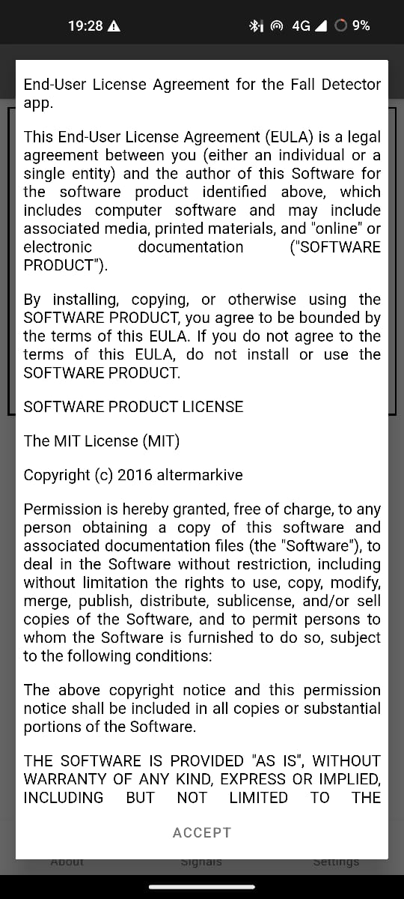
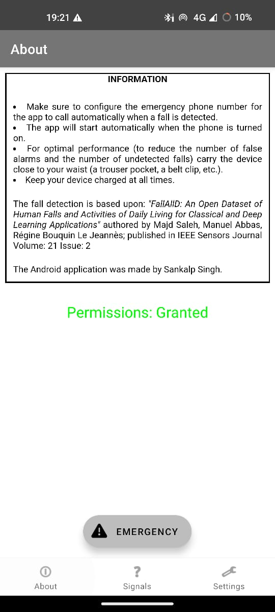
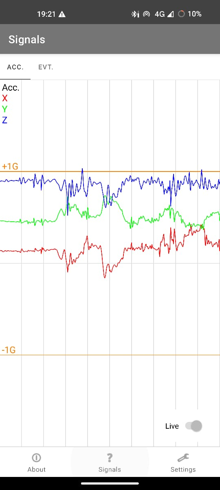
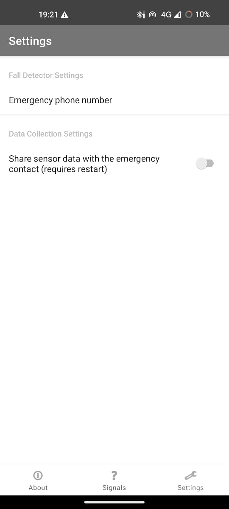
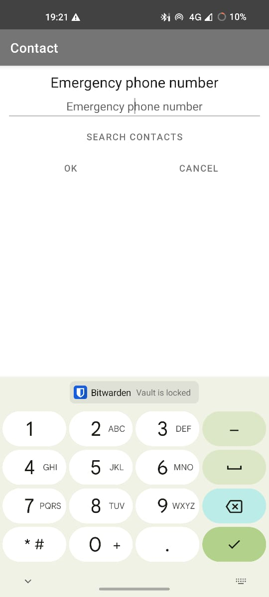

# Fall Detector Android App

## INTRODUCTION

A Fall Detection app based on Machine Learning model

## USER GUIDE

* Make sure to configure the emergency phone number for the app to call automatically when a fall is detected.
* Calls from that number will be answered automatically.
* The app will start automatically when the phone is turned on.
* For optimal performance (to reduce the number of false alarms and the number of undetected falls) carry the device close to your waist (a trouser pocket, a belt clip, etc.).
* Keep your device charged at all times.

## SCREENSHOTS

 EULA screen (MIT license)     | About view (with instructions & emergency button) | Sensor & detection signals view (pausable & zoomable) | Settings view (to set emergency number & data collection) | Emergency number editor (with contact book lookup)
:-----------------------------:|:-------------------------------------------------:|:-----------------------------------------------------:|:---------------------------------------------------------:|:--------------------------------------------------:
  |                     |                       |                          | 

## CREDITS

The fall detection is based upon the FallAllD: A Comprehensive Dataset of Human Falls and Activities of Daily Living by Majd Saleh, Université de Rennes 1, LTSI, Rennes, 35000, France, and INSERM, U1099, Rennes, 35000, France (search for the paper [here](https://ieee-dataport.org/open-access/fallalld-comprehensive-dataset-human-falls-and-activities-daily-living))

